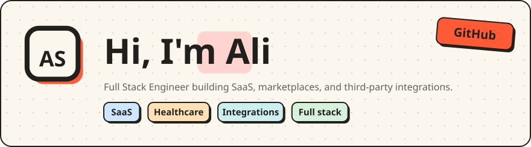
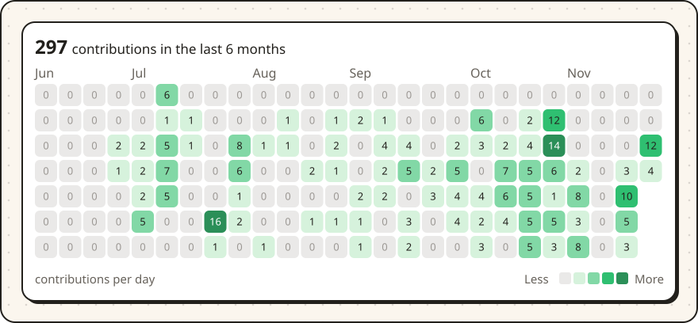
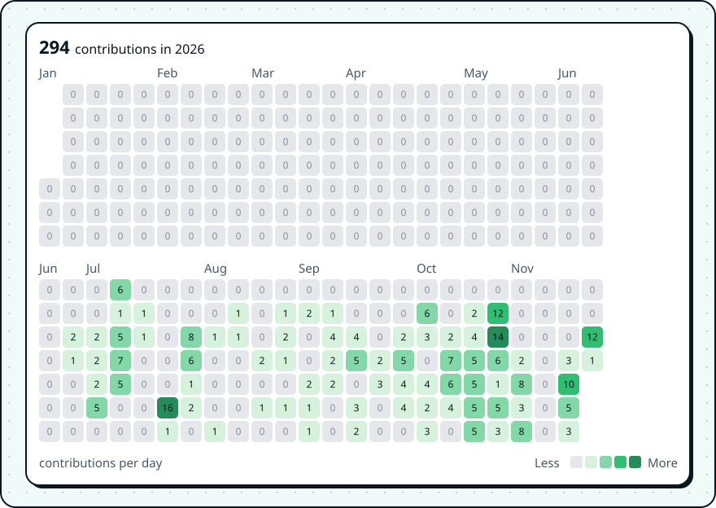
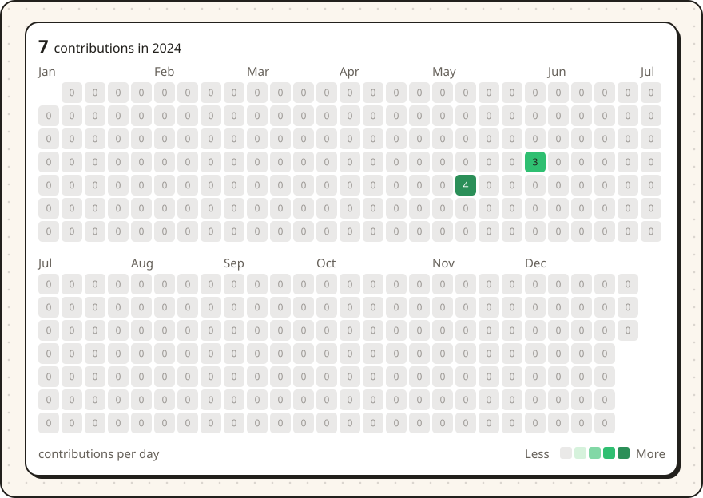

<a href="https://github.com/Ali-salman04"><picture><source media="(prefers-color-scheme: dark) and (max-width: 600px)" srcset="assets/hero-phone-dark.svg"><source media="(max-width: 600px)" srcset="assets/hero-phone-light.svg"><source media="(prefers-color-scheme: dark)" srcset="assets/hero-dark.svg"></picture></a>

<a href="https://github.com/Ali-salman04"><picture><source media="(prefers-color-scheme: dark)" srcset="assets/badge-gh-dark.svg"></picture></a>
<a href="https://www.linkedin.com/in/hafiz-ali-salman"><picture><source media="(prefers-color-scheme: dark)" srcset="assets/badge-li-dark.svg"></picture></a>
<a href="mailto:halisalman04@gmail.com"><picture><source media="(prefers-color-scheme: dark)" srcset="assets/badge-email-dark.svg"></picture></a>

<picture><source media="(prefers-color-scheme: dark) and (max-width: 600px)" srcset="assets/github-phone-dark.svg"><source media="(max-width: 600px)" srcset="assets/github-phone-light.svg"><source media="(prefers-color-scheme: dark)" srcset="assets/github-dark.svg"></picture>

<picture><source media="(prefers-color-scheme: dark) and (max-width: 600px)" srcset="assets/graph-6m-phone-dark.svg"><source media="(max-width: 600px)" srcset="assets/graph-6m-phone-light.svg"><source media="(prefers-color-scheme: dark)" srcset="assets/graph-6m-dark.svg"></picture>

Last 12 months: 294 contributions

<picture><source media="(prefers-color-scheme: dark) and (max-width: 600px)" srcset="assets/graph-12m-phone-dark.svg"><source media="(max-width: 600px)" srcset="assets/graph-12m-phone-light.svg"><source media="(prefers-color-scheme: dark)" srcset="assets/graph-12m-dark.svg"></picture>

2026: 294 contributions

<picture><source media="(prefers-color-scheme: dark) and (max-width: 600px)" srcset="assets/graph-2026-phone-dark.svg"><source media="(max-width: 600px)" srcset="assets/graph-2026-phone-light.svg"><source media="(prefers-color-scheme: dark)" srcset="assets/graph-2026-dark.svg"></picture>

2025: 26 contributions

<picture><source media="(prefers-color-scheme: dark) and (max-width: 600px)" srcset="assets/graph-2025-phone-dark.svg"><source media="(max-width: 600px)" srcset="assets/graph-2025-phone-light.svg"><source media="(prefers-color-scheme: dark)" srcset="assets/graph-2025-dark.svg"></picture>

2024: 7 contributions

<picture><source media="(prefers-color-scheme: dark) and (max-width: 600px)" srcset="assets/graph-2024-phone-dark.svg"><source media="(max-width: 600px)" srcset="assets/graph-2024-phone-light.svg"><source media="(prefers-color-scheme: dark)" srcset="assets/graph-2024-dark.svg"></picture>

<picture><source media="(prefers-color-scheme: dark) and (max-width: 600px)" srcset="assets/line-30d-phone-dark.svg"><source media="(max-width: 600px)" srcset="assets/line-30d-phone-light.svg"><source media="(prefers-color-scheme: dark)" srcset="assets/line-30d-dark.svg"></picture>

<picture><source media="(prefers-color-scheme: dark) and (max-width: 600px)" srcset="assets/whoami-phone-dark.svg"><source media="(max-width: 600px)" srcset="assets/whoami-phone-light.svg"><source media="(prefers-color-scheme: dark)" srcset="assets/whoami-dark.svg"></picture>

<picture><source media="(prefers-color-scheme: dark) and (max-width: 600px)" srcset="assets/label-ship-phone-dark.svg"><source media="(max-width: 600px)" srcset="assets/label-ship-phone-light.svg"><source media="(prefers-color-scheme: dark)" srcset="assets/label-ship-dark.svg"></picture>

<a href="https://github.com/Ali-salman04"><picture><source media="(prefers-color-scheme: dark) and (max-width: 600px)" srcset="assets/app-medsynthea-phone-dark.svg"><source media="(max-width: 600px)" srcset="assets/app-medsynthea-phone-light.svg"><source media="(prefers-color-scheme: dark)" srcset="assets/app-medsynthea-dark.svg"></picture></a>
<a href="https://github.com/Ali-salman04/skin_disease"><picture><source media="(prefers-color-scheme: dark) and (max-width: 600px)" srcset="assets/app-derma-ai-phone-dark.svg"><source media="(max-width: 600px)" srcset="assets/app-derma-ai-phone-light.svg"><source media="(prefers-color-scheme: dark)" srcset="assets/app-derma-ai-dark.svg"></picture></a>
<a href="https://github.com/Ali-salman04/active.solar.tech"><picture><source media="(prefers-color-scheme: dark) and (max-width: 600px)" srcset="assets/app-active-tech-phone-dark.svg"><source media="(max-width: 600px)" srcset="assets/app-active-tech-phone-light.svg"><source media="(prefers-color-scheme: dark)" srcset="assets/app-active-tech-dark.svg"></picture></a>
<a href="https://github.com/Ali-salman04"><picture><source media="(prefers-color-scheme: dark) and (max-width: 600px)" srcset="assets/app-saas-phone-dark.svg"><source media="(max-width: 600px)" srcset="assets/app-saas-phone-light.svg"><source media="(prefers-color-scheme: dark)" srcset="assets/app-saas-dark.svg"></picture></a>

More ships: <a href="https://github.com/Ali-salman04/Ru-Novel">Ru-Novel</a> · <a href="https://github.com/Ali-salman04/School-Record-Inventory">School-Record-Inventory</a> · <a href="https://github.com/Ali-salman04/Expense-App">Expense-App</a> · <a href="https://github.com/Ali-salman04/Portfilo">Portfilo</a>

Drawn in the Hafiz Ali Salman teal design system · numbers redrawn by a GitHub Action · <a href="https://www.linkedin.com/in/hafiz-ali-salman">LinkedIn</a> · <a href="https://github.com/Ali-salman04">GitHub</a>

